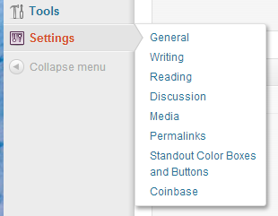

# Coinbase Wordpress Plugin

A Wordpress plugin and widget that lets you accept bitcoin on your site!

## Installation

Download the latest version of the plugin and install it under `wp-content/plugins/coinbase-wordpress`.

Visit the Coinbase Settings panel in your site's administrator panel, and follow the instructions to connect the plugin with your Coinbase account.
