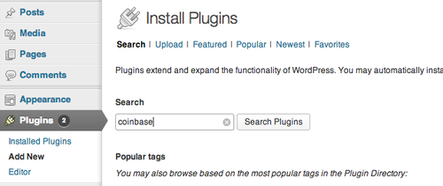
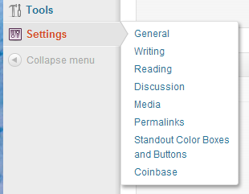
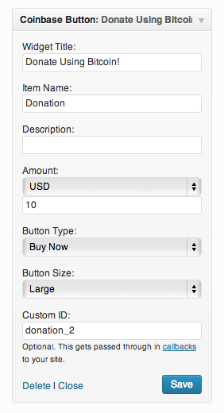

# Coinbase WordPress Plugin

A WordPress plugin and widget that lets you accept bitcoin on your site!

## Installation

### Install From Within WordPress

1. Generate an API key with the 'wallet:checkouts:create' permission at https://coinbase.com/settings/api. For security reasons, please do not grant any other permissions to this key. If you don't have a Coinbase account, sign up at https://coinbase.com/merchants. Coinbase offers daily payouts for merchants in the United States. For more infomation on setting up payouts, see https://coinbase.com/docs/merchant_tools/payouts.

2. Visit your WordPress site, then click "Plugins", and search for "coinbase"

  

3. Go to "Settings" -> "Coinbase", and enter the credentials obtained in step 1.

  

4. Now that the widget is enabled you can add a bitcoin payment button anywhere on your blog using one of two methods:

  * a “short code” that looks like this:

    `[coinbase_button name=”Alpaca Socks” amount=”10.00” currency=”CAD”]`

    You can add any customizable values as described [in our documentation](https://developers.coinbase.com/api/v2#create-checkout).  This works on any page or location of your site.

  * a WordPress “widget” that appears in the right sidebar of your app.

    
