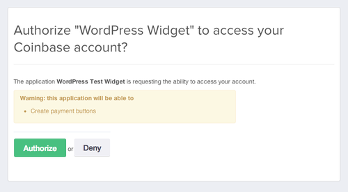

# Coinbase Wordpress Plugin

A Wordpress plugin and widget that lets you accept bitcoin on your site!

## Installation

### Install From Within Wordpress

1. Visit your wordpress site, then click "Plugins", and search for "coinbase"

  

2. Go to "Settings" -> "Coinbase", and follow the instructions to connect a new OAuth2 App

  

3. Click on "Authorize Wordpress Plugin" and you'll be taken to Coinbase to grant the app access

  

  Notice that you are only authenticating the widget to create payment buttons with your Coinbase account, and nothing else.  It won’t have access to send, receive, or do anything else with your account.

  This makes use of the very [handy oauth permissions](https://coinbase.com/docs/api/authentication#permissions) in our API.

4. Now that the widget is enabled you can add a bitcoin payment button anywhere on your blog using one of two methods:

  * a “short code” that looks like this:

    `[coinbase_button name=”Alpaca Socks” price_string=”10.00” price_currency_iso=”CAD”]`

    You can add any customizable values as described [in our documentation](https://coinbase.com/api/doc/1.0/buttons/create.html).  This works on any page or location of your site.

  * a WordPress “widget” that appears in the right sidebar of your app.

    